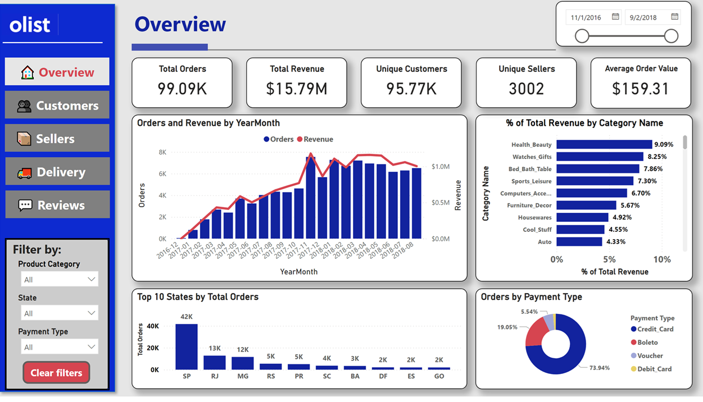

# 📦 Olist E-Commerce Analysis (EDA + Power BI Dashboard)

This project explores the **Brazilian E-Commerce Public Dataset** by Olist, including a full **Exploratory Data Analysis (EDA)** in Python and a complete **interactive Power BI dashboard**.

The project is structured into three main components:

1. **EDA in Jupyter Notebook** — deep dive into customer behavior, delivery performance, seller patterns, review text analysis, and KPI creation.  
2. **Power BI Dashboard** — five pages (Overview, Customers, Sellers, Deliveries, Reviews) for interactive exploration of all insights.
3. **Report in PDF** — a comprehensive analytical report that documents the full lifecycle of the project, from data exploration to business recommendations.

---

## 📊 Interactive Dashboard (Power BI)

👉 **[Click here to explore the interactive dashboard](https://app.powerbi.com/view?r=eyJrIjoiYjkwYjcxNjUtNWZmYS00MzBhLTlhMWQtNTFhN2YyY2Q0YTQxIiwidCI6ImEzNGM1MTliLTQ0ZDEtNGRlNi1iNTVlLWQ0NmNmZWFhODJhNSJ9)**  
*(opens in your browser — no download required)*

---

## 🖼️ Dashboard Preview

Below is a preview of the **Overview page** of the Power BI dashboard:

<p align="center">
  
</p>

---

## 🗂️ Dashboard Files (Downloadable)

### **📁 Power BI (PBIX)**  
GitHub cannot preview PBIX files, but they can be downloaded:

- `Dashboard/olist_performance_dashboard.pbix`

### **📄 PDF Version (Static Pages)**

- `olist_performance_dashboard.pdf`

---

## 📘 Jupyter Notebook (EDA)

- `Notebooks/EcommercePerformanceEDA.ipynb` — full analysis including:
  - Data cleaning & preparation  
  - Revenue & demand trends  
  - Cohort analysis  
  - Delivery punctuality impact  
  - Review text mining (bigrams, trigrams, sentiment tendencies)  
  - Seller concentration metrics  
  - KPI definitions for BI consumption  

---

## 📝 Full Analytical Report (PDF)

- `Report/Olist_Report.pdf`

I put together a complete write-up of this project — the kind of report I'd actually present to stakeholders. It walks through the entire analysis, from initial data exploration to final recommendations.

The report presents:

- A structured exploratory data analysis covering orders, revenue, customers, sellers, logistics, and reviews

- Deep dives into delivery performance, shipping costs, customer satisfaction, and retention

- Geographic and category breakdowns showing where the business is strong and where it's struggling

- Clear, data-driven business interpretations, showing where the business is strong and where it's struggling

- A final set of actionable recommendations

- Documentation of the dashboard and how to use it

It isn't a technical document focused on code — it's focused on insights, how they were generated, and what they mean for the business. If you want the full story and methodology used in this project, check out the PDF in the repo.

---

## 🔍 Key Insights

- **Retention is low**  
  - Nearly all customers buy once; repeat buyers are only **3%**
    
- **Delivery punctuality is the strongest driver of customer satisfaction**  
  - On-time delivery avg rating ≈ **4.21**  
  - Late delivery avg rating ≈ **2.55**

- **Sales are highly concentrated**  
  - Top 10% of sellers handle **~68% of all orders**

- **Event-driven demand surges**  
  - Massive spike during **Black Friday**, indicating event-aware capacity planning is crucial

- **Text analysis shows the most common customer complaints relate to:**  
  - Product not arriving  
  - Delays  
  - Incorrect or missing items  

---

## 📁 Dataset

The dataset is not included in the repository.  
Download it from Kaggle:  
https://www.kaggle.com/datasets/olistbr/brazilian-ecommerce

---

## ▶️ How to Run the Notebook

1. Clone repository:

```bash
git clone https://github.com/AlexPanoni/Olist_Ecommerce_Analysis.git
cd Olist_Ecommerce_Analysis
```

2. Create a Python environment:

```bash
python -m venv env

# Windows
env\Scripts\activate

# macOS / Linux
source env/bin/activate
```

3. Install dependencies:
```bash
pip install -r requirements.txt
```
4. Place the CSV files into the `Datasets/` folder.

5. Launch the notebook:
```bash
jupyter notebook Notebooks/EcommercePerformanceEDA.ipynb
```

## ⭐ Project Structure

```
Olist_Ecommerce_EDA/
│
├── Dashboard/
│   ├── Olist_Dashboard.pbix
│   └── Olist_Dashboard.pdf
│
├── Images/
│   ├── dashboard_overview.png
│   ├── dashboard_customers.png
│   ├── dashboard_sellers.png
│   ├── dashboard_deliveries.png
│   └── dashboard_reviews.png
│
├── Notebooks/
│   └── EcommercePerformanceEDA.ipynb
│
├── README.md
└── requirements.txt
```


